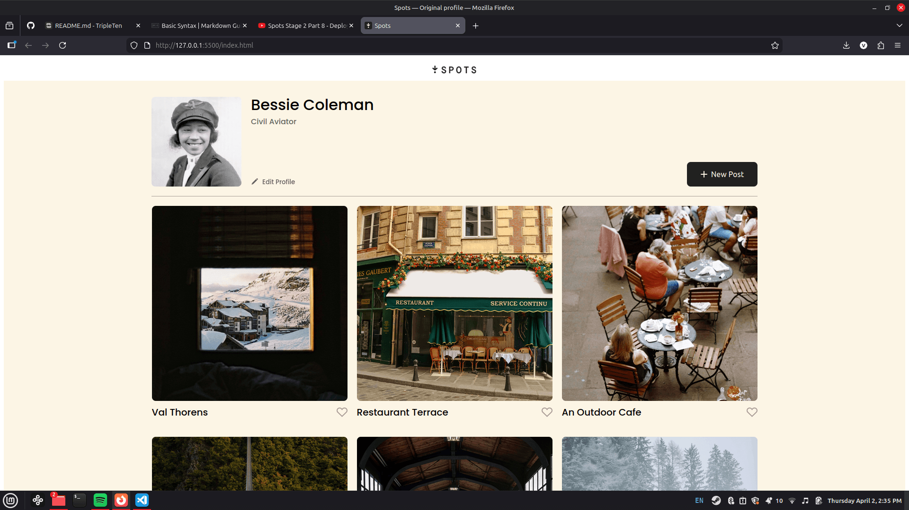
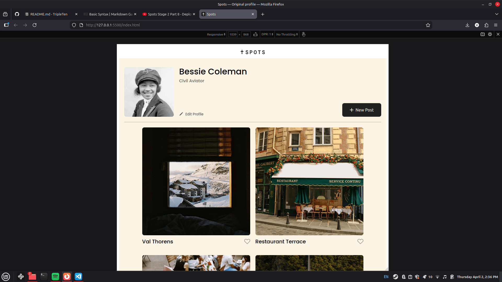
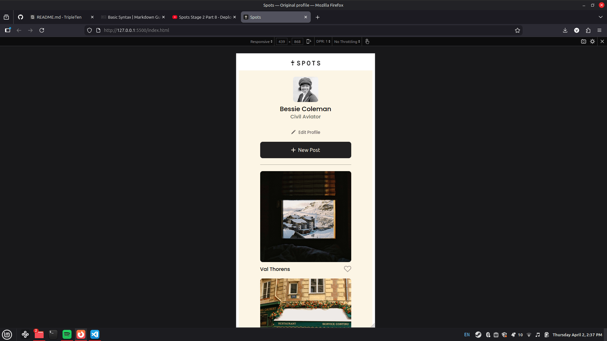
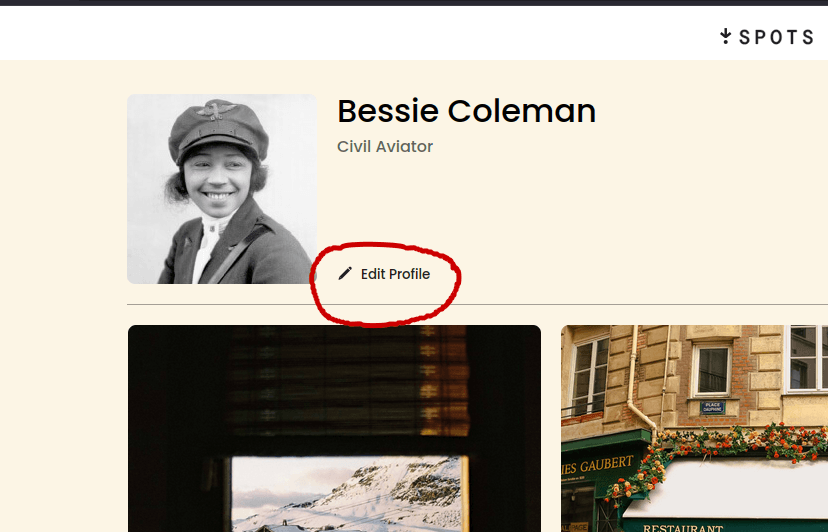
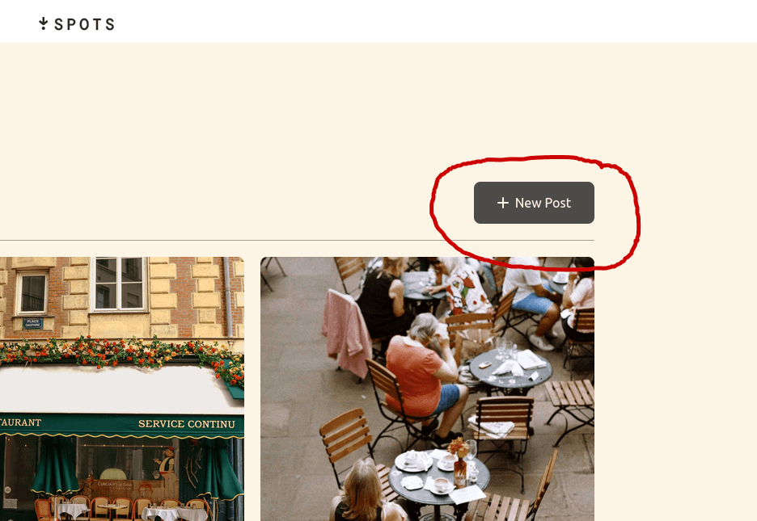
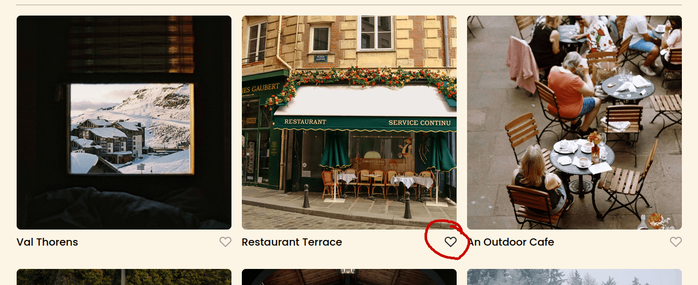

# Spots

Your destination for sharing images on the web!

## Overview

- How it works
- Tech Stack
- Media Showcase
- Links

**How it works**

Spots is an interactive image-sharing application. Users can upload or remove their own photos, as well as like and share photos from other users!

**Tech Stack**

- Semantic HTML5
- CSS (Flexbox, Positioning, hover states)
- Responsive Design using CSS Grid and media queries

**Media Showcase**

**Links**

Deployed to GitHub Pages

- [Deployment link](https://jor-i.github.io/se_project_spots/)
